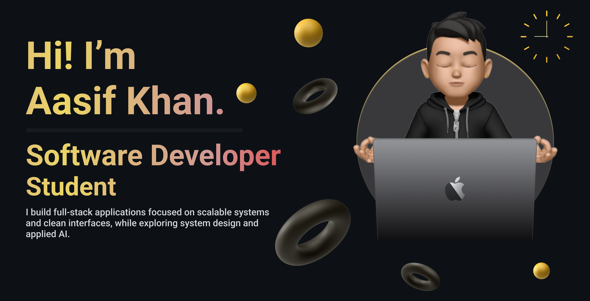

<!-- Custom Banner -->

  

<h3 align="center">
I'm a Software Engineering student at VIT, a full-stack developer with a strong interest in building clean, functional, and user-friendly web applications. 
Alongside development, I’m exploring AI/ML and continuously expanding my knowledge of emerging technologies.
</h3>

 

- I’m currently learning **Backend Development**
- I write articles on [Hashnode](https://hashnode.com/@aasif10)
- Ask me about **Frontend Development**
- How to reach me: **aasifkhan.a2006@gmail.com**

 

<h3 align="center">Languages and Tools:</h3>

<table align="center">

<tr>
<td align="center" width="96">

 Python
</td>

<td align="center" width="96">

 Java
</td>

<td align="center" width="96">

 C++
</td>

<td align="center" width="96">

 JavaScript
</td>

<td align="center" width="96">

 React
</td>

<td align="center" width="96">

 Node.js
</td>

<td align="center" width="96">

 MySQL
</td>

<td align="center" width="96">

 GitHub
</td>
</tr>

<tr>
<td align="center" width="96">

 HTML
</td>

<td align="center" width="96">

 CSS
</td>

<td align="center" width="96">

 Tailwind
</td>

<td align="center" width="96">

 Express
</td>

<td align="center" width="96">

 MongoDB
</td>

<td align="center" width="96">

 Firebase
</td>

<td align="center" width="96">

 Supabase
</td>

<td align="center" width="96">

 Postman
</td>
</tr>

<tr>
<td align="center" width="96">

 Git
</td>

<td align="center" width="96">

 VS Code
</td>

<td align="center" width="96">

 GraphQL
</td>

<td align="center" width="96">

 C
</td>

<td align="center" width="96">

 Bash
</td>

<td align="center" width="96">

 Linux
</td>

<td align="center" width="96">

 NPM
</td>

<td align="center" width="96">

 CLI
</td>
</tr>

</table>

 

## Connect with Me

- LinkedIn: [LinkedIn](https://linkedin.com/in/aasifkhan10)
- Email: aasifkhan.a2006@gmail.com
